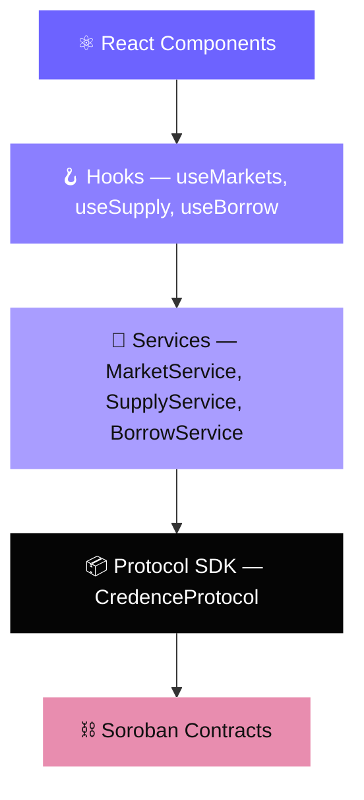
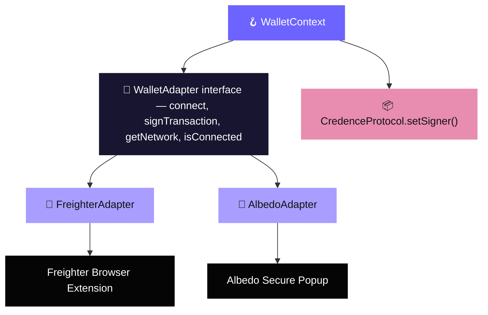
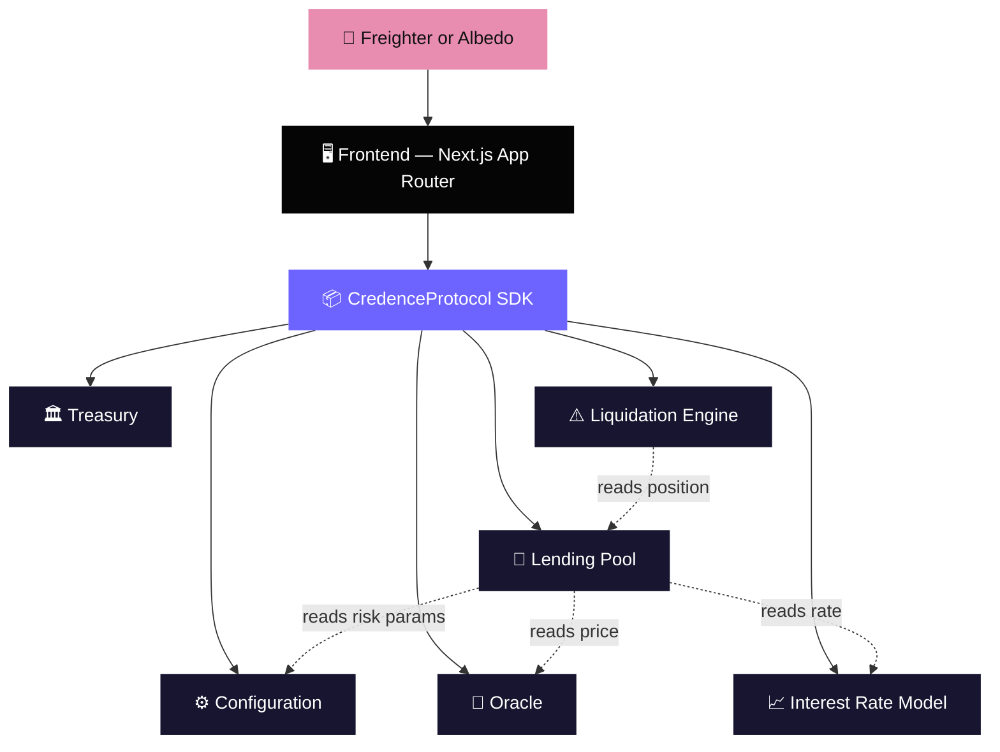
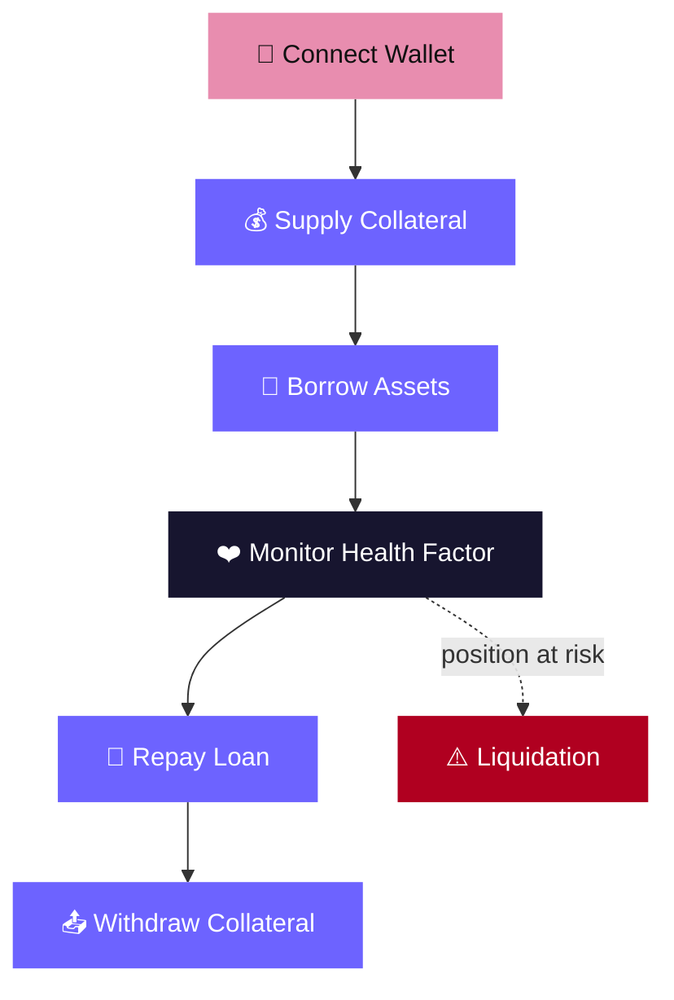
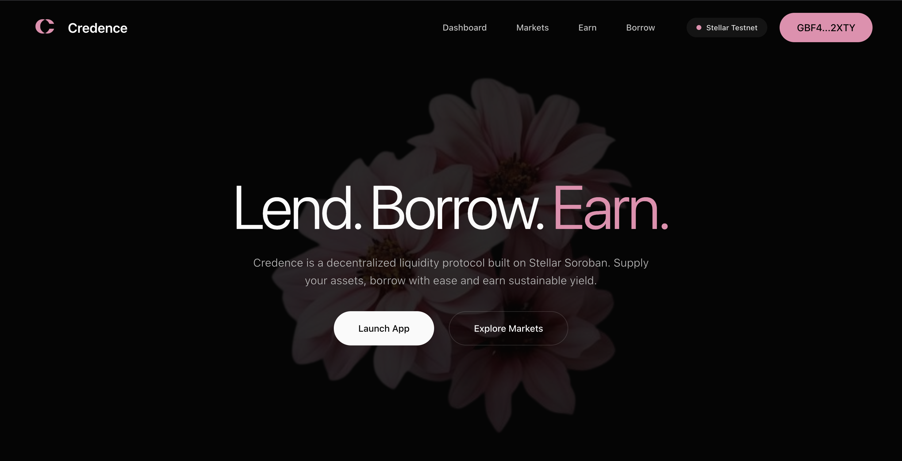
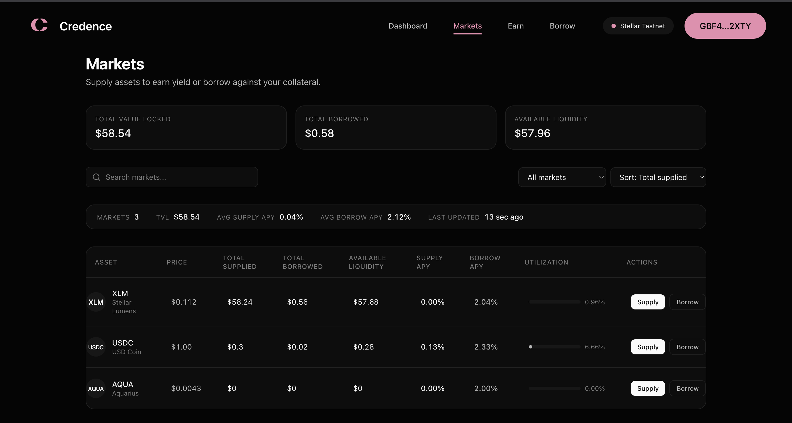
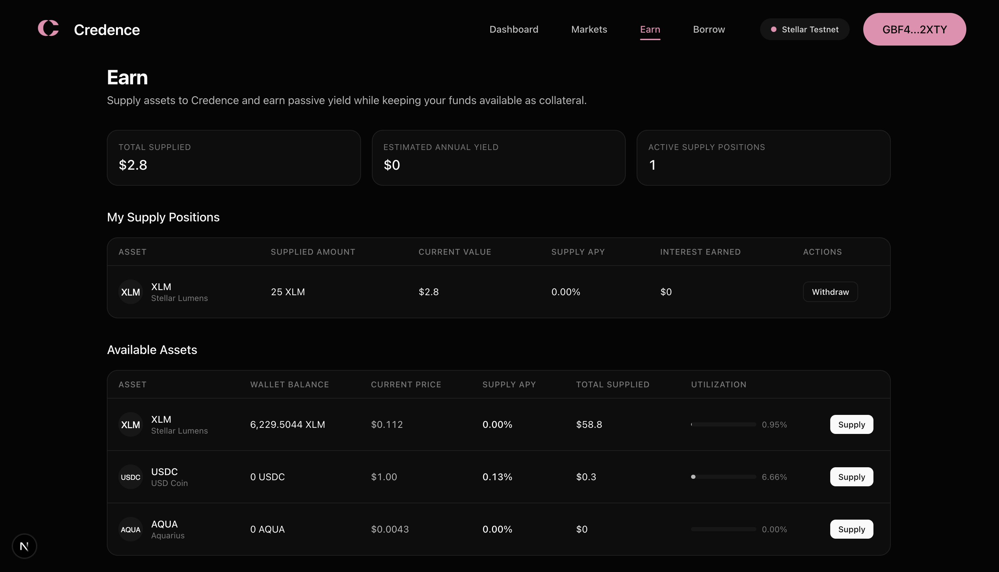
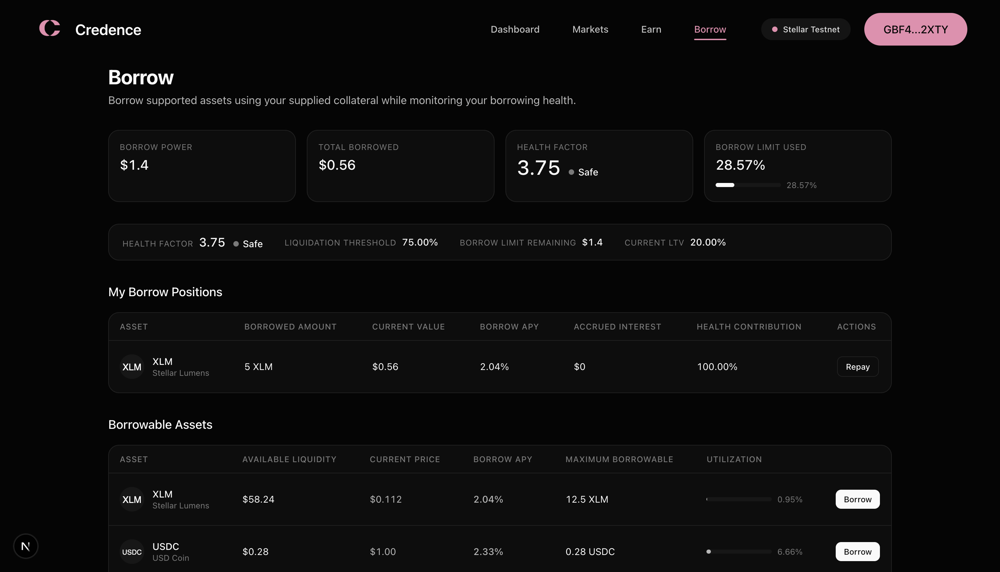

<div align="center">


# Credence

### Overcollateralized lending, built natively on Soroban.

Supply. Borrow. Earn. All backed by live smart contracts on Stellar — no mocks, no fabricated numbers.

<br />

[](https://credence-stellar.vercel.app)
[](./LICENSE)
[](https://stellar.org)
[](https://soroban.stellar.org)
[](https://www.typescriptlang.org/)
[](https://nextjs.org/)
[](https://credence-stellar.vercel.app)
[](https://credence-stellar.vercel.app)
[](https://stellar.org)

<br />

**[🚀 Live Demo](https://credence-stellar.vercel.app)** &nbsp;·&nbsp;
**[📖 Documentation](#-table-of-contents)** &nbsp;·&nbsp;
**[🏗️ Architecture](#️-architecture)** &nbsp;·&nbsp;
**[📜 Smart Contracts](#-smart-contracts)**

</div>

<br />

> [!NOTE]
> Credence is deployed and fully operational on **Stellar Testnet**. Every number in this README — contract addresses, market data, APYs — reflects the live, deployed protocol. Nothing here is a mockup.

<br />

## 📋 Table of Contents

- [Why Credence](#-why-credence)
- [Features](#-features)
- [Architecture](#️-architecture)
- [Project Structure](#-project-structure)
- [Tech Stack](#-tech-stack)
- [Smart Contracts](#-smart-contracts)
- [User Flow](#-user-flow)
- [Screenshots](#-screenshots)
- [Local Development](#-local-development)
- [Deployment](#-deployment)
- [Known Limitations](#️-known-limitations)
- [Roadmap](#️-roadmap)
- [Contributing](#-contributing)
- [License](#-license)

<br />

---

## 💡 Why Credence

Lending protocols are the backbone of decentralized finance — they let holders of an asset earn yield by supplying it as liquidity, while others borrow against collateral without ever touching a bank. Aave and Compound proved the model on Ethereum. Credence brings the same primitive to **Stellar**, built from the ground up on **Soroban**.

**Why overcollateralization matters.** On-chain lending has no credit score, no repossession, no legal recourse — the only thing standing between a lender and a loss is math. Every loan on Credence must be backed by collateral worth more than the debt it secures, continuously priced by an on-chain oracle and enforced by the protocol itself. If a position's health factor drops too far, it becomes eligible for liquidation before the pool can go underwater.

**Why Stellar.** Stellar was designed for fast, cheap, predictable settlement — sub-5-second finality and fractions of a cent per transaction. That's the right foundation for a lending market where positions need to be checked and, when necessary, liquidated quickly.

**Why Soroban.** Soroban is Stellar's Rust-based smart contract platform. It gives Credence typed, auditable, WASM-compiled contract logic instead of ad-hoc scripting — the same rigor you'd expect from a protocol handling real collateral.

**Why this architecture.** Credence separates concerns deliberately: isolated contracts for configuration, pricing, interest calculation, custody, and liquidation, fronted by a typed SDK so the UI never talks to Soroban directly. That separation is what makes the protocol auditable one contract at a time — and what let this frontend evolve from mocked data to a fully live integration without touching a single page's UI.

<br />

---

## ✨ Features

<table>
<tr>
<td width="33%" valign="top">

### 💰 Supply Assets
Deposit XLM, USDC, or AQUA as collateral and see your position reflected on-chain immediately after confirmation.

</td>
<td width="33%" valign="top">

### 🏦 Borrow Assets
Borrow against your supplied collateral, gated by real-time LTV limits computed from your live collateral value.

</td>
<td width="33%" valign="top">

### ❤️ Live Health Factor
Every borrow position shows a continuously computed health factor, derived from oracle prices and the liquidation threshold.

</td>
</tr>
<tr>
<td width="33%" valign="top">

### 📈 Dynamic Interest Rates
Borrow APY follows a piecewise-linear utilization curve — cheap when liquidity is abundant, expensive as a pool nears full utilization.

</td>
<td width="33%" valign="top">

### 🔮 Real-Time Oracle Pricing
Asset prices are read directly from the on-chain `oracle` contract on every market and position calculation — never hardcoded.

</td>
<td width="33%" valign="top">

### 📊 Automatic LTV Calculations
Maximum borrowable amounts, borrow power remaining, and collateral requirements are all derived live, not estimated client-side.

</td>
</tr>
<tr>
<td width="33%" valign="top">

### 🛡️ Risk Management
Per-asset LTV and liquidation thresholds, enforced at the contract level — the pool itself rejects unsafe borrows and withdrawals.

</td>
<td width="33%" valign="top">

### 🔗 Multi-Wallet Support
Connect with [Freighter](https://www.freighter.app/) or [Albedo](https://albedo.link/) through a shared wallet-adapter interface — pick a wallet once, reconnect automatically, sign real Soroban transactions with either.

</td>
<td width="33%" valign="top">

### ⚡ Live Protocol Data
Markets, positions, and protocol summary stats are all sourced from deployed contracts via React Query — no mocked fixtures anywhere.

</td>
</tr>
<tr>
<td width="33%" valign="top">

### 🚀 Production Deployment
Live on Vercel, backed by contracts deployed and verified on Stellar Testnet — not a local demo.

</td>
<td width="33%" valign="top">

### 📱 Responsive UI
A single design system spanning Landing, Markets, Earn, Borrow, and Dashboard, built to work from mobile to desktop.

</td>
<td width="33%" valign="top">

### 🔄 Real-Time Sync
A single shared React Query cache means a supply on one page instantly invalidates stale data everywhere else in the app.

</td>
</tr>
</table>

<br />

---

## 🏗️ Architecture

Credence enforces a strict one-way data flow. React components never call the SDK, and the SDK never gets bypassed to call a contract directly.

### Frontend Data Flow



React Query wraps every hook — polling, caching, and invalidation all live at the hook layer, so services and the SDK stay pure data-access code with no UI concerns.

### Wallet Adapter Layer

Wallet support is pluggable. `WalletContext` never talks to a wallet SDK directly — it goes through a common `WalletAdapter` interface, so adding a new wallet means writing one adapter file, not touching the context, the SDK, or any page.



The active adapter's `signTransaction` is injected into the SDK via `setSigner()` — the SDK itself never imports a wallet package, so every write operation (supply, borrow, repay, withdraw) works identically no matter which wallet is connected.

### Protocol Architecture



`Configuration` is the hub every other contract reads from — LTV, liquidation thresholds, and contract addresses are all resolved through it, so risk parameters can be updated in one place without redeploying the pool.

<br />

---

## 📁 Project Structure

```text
credence/
├── contracts/                     # Soroban smart contracts (Rust)
│   ├── configuration/              # Central risk-parameter & address registry
│   ├── oracle/                     # On-chain asset price feed
│   ├── interest_rate/              # Utilization-based interest rate model
│   ├── lending_pool/                # Core deposit / borrow / repay / withdraw logic
│   ├── liquidation_engine/          # Undercollateralized position liquidation
│   └── treasury/                   # Protocol reserve handling
│
├── packages/
│   ├── sdk/
│   │   ├── src/index.ts             # CredenceProtocol — the only thing that talks to contracts
│   │   └── bindings/                # Generated per-contract TypeScript clients
│   └── interfaces/src/              # Shared protocol types (MarketData, UserPosition, ...)
│
├── src/
│   ├── app/                        # Next.js App Router pages
│   │   ├── page.tsx                  # Landing
│   │   ├── markets/                  # Markets
│   │   ├── earn/                     # Supply / Earn
│   │   ├── borrow/                   # Borrow
│   │   └── dashboard/                # Wallet dashboard
│   ├── components/
│   │   ├── wallet/                     # WalletSelectorModal (multi-wallet picker)
│   │   └── ...                         # Landing / Markets / Earn / Borrow UI, grouped by domain
│   ├── context/                    # WalletContext — wallet-agnostic session state
│   ├── hooks/                      # React Query hooks — one per protocol concern
│   └── lib/
│       ├── services/
│       │   ├── wallet-adapters/          # WalletAdapter interface + FreighterAdapter + AlbedoAdapter
│       │   └── wallet-service.ts         # Wallet-agnostic Stellar plumbing (balances, tx submission)
│       ├── protocol.ts               # Singleton CredenceProtocol instance
│       └── *-aggregates.ts           # Pure client-side math over live protocol data
│
├── registry/
│   └── deployments.json            # Live contract + asset addresses per network
│
└── tests/                          # Integration tests
```

<br />

---

## 🛠️ Tech Stack

<table>
<tr><th>Category</th><th>Technology</th></tr>
<tr><td><strong>Frontend</strong></td><td>Next.js 16 (App Router), React 19, Tailwind CSS 4, Framer Motion</td></tr>
<tr><td><strong>Data Layer</strong></td><td>TanStack React Query — single global cache, polling, mutation invalidation</td></tr>
<tr><td><strong>Blockchain</strong></td><td>Stellar Testnet, Soroban smart contracts (Rust), <code>@stellar/stellar-sdk</code></td></tr>
<tr><td><strong>Wallet</strong></td><td>Freighter (<code>@stellar/freighter-api</code>) &amp; Albedo (<code>@albedo-link/intent</code>) via a shared wallet-adapter interface</td></tr>
<tr><td><strong>Smart Contracts</strong></td><td>Rust, <code>soroban-sdk</code>, WASM (<code>wasm32v1-none</code>)</td></tr>
<tr><td><strong>Deployment</strong></td><td>Vercel (frontend), Stellar Testnet + <code>stellar-cli</code> (contracts)</td></tr>
<tr><td><strong>Languages</strong></td><td>TypeScript, Rust</td></tr>
<tr><td><strong>Tooling</strong></td><td>ESLint, npm, Turbopack</td></tr>
</table>

<br />

---

## 📜 Smart Contracts

All six contracts below are deployed and live on **Stellar Testnet**. Addresses are read at runtime from [`registry/deployments.json`](./registry/deployments.json) — nothing in the frontend hardcodes an address.

<table>
<tr>
<td width="20%"><strong>🏦 Lending Pool</strong></td>
<td>

The core of the protocol. Holds deposited collateral, tracks each user's supplied and borrowed balances per asset, and enforces that no borrow or withdrawal can push a position below its required collateralization. Debt is tracked as WAD-scaled shares against a global borrow index, so interest accrues without a per-block state write for every borrower.

`CD6KIVR7Q57W37SWE3MX3T5LVX7LXGF7ES2GRKSVFPBHR3MUWYZE4QDK`

</td>
</tr>
<tr>
<td><strong>🔮 Oracle</strong></td>
<td>

Stores the current USD price for each supported asset, admin-updated and timestamped on write. Every market, position, and health-factor calculation in the protocol reads price from here — there is no client-side price fallback.

`CD4HRMQGXNOO4CDB4J7PQYI5MTFQNA2TGIMRMFUHP5Q3PH7T2EB6SUTT`

</td>
</tr>
<tr>
<td><strong>📈 Interest Rate Model</strong></td>
<td>

Computes borrow APY from pool utilization using a piecewise-linear curve (an "Aave-style" kink at the optimal utilization point), and tracks a compounding borrow index per asset so debt grows correctly over time without the pool needing to touch every position on every block.

`CA7QVKZN7YYVQ4XWYRSJKRN4FODGGLJ4P4ZYXKHOMQTJ3DM4HRGWQT3Q`

</td>
</tr>
<tr>
<td><strong>🏛️ Treasury</strong></td>
<td>

Receives the protocol's reserve-factor share of interest — the portion of borrower interest that doesn't go to suppliers, set aside for protocol sustainability.

`CARFUMHTTKBZCMXMZDTFBHTIFILAMUHDCXHQQLZEWL6BIU556GIBWWN5`

</td>
</tr>
<tr>
<td><strong>⚙️ Configuration</strong></td>
<td>

The protocol's control plane. Holds LTV, liquidation threshold, liquidation bonus, and reserve factor, plus the addresses of every other contract. Every other contract resolves its dependencies through this one, so parameters can be tuned centrally.

`CC3P2CRXZP4EQXKQ2RTU3ZKD4SKE6LG5PW26TJC6ZMMFOIQ7WUO3S3FK`

</td>
</tr>
<tr>
<td><strong>⚠️ Liquidation Engine</strong></td>
<td>

Allows a third party to repay part of an undercollateralized borrower's debt in exchange for a discounted claim on their collateral, keeping the pool solvent when a position's health factor falls below 1.0.

`CBQDUJ5NW6CIIXDDY4OEQAVTQ3B5AXV6XNTM7DV6HI3U3YUS6X34KW54`

</td>
</tr>
</table>

<br />

---

## 🔁 User Flow



<br />

---

## 🖼️ Screenshots

### Landing Page

Hero section and supported markets, connected to a live Testnet wallet.

<p align="center">
  
</p>

---

### Markets

Live TVL, total borrowed, available liquidity, and per-asset APY/utilization — all read directly from the deployed contracts.

<p align="center">
  
</p>

---

### Earn

Supply positions, wallet balances, and available assets with real-time APY previews.

<p align="center">
  
</p>

---

### Borrow

Health factor, liquidation threshold, and borrow positions, all computed live from oracle prices and pool state.

<p align="center">
  
</p>

<br />

> [!TIP]
> Dashboard, mobile, and wallet-selector captures aren't in yet — drop them in `public/images/` and reference them here the same way.

<br />

---

## 🚀 Local Development

### Prerequisites

- [Node.js](https://nodejs.org/) 20+
- [Rust](https://www.rust-lang.org/) + `wasm32v1-none` target (only needed if you're modifying contracts)
- [Stellar CLI](https://developers.stellar.org/docs/tools/cli/stellar-cli) (`stellar --version`)
- A supported wallet, set to **Testnet** — pick one:
  - [Freighter](https://www.freighter.app/) browser extension, **or**
  - [Albedo](https://albedo.link/) — no install required, it signs through a secure popup window in any browser

### Setup

```bash
# Clone the repository
git clone https://github.com/swarupasaha2005-hue/CREDENCE.git
cd CREDENCE

# Install dependencies
npm install

# Start the dev server
npm run dev
```

Open [http://localhost:3000](http://localhost:3000) — the app connects to the already-deployed Testnet contracts in [`registry/deployments.json`](./registry/deployments.json), so no local contract deployment is required to run the frontend.

### Building contracts (optional)

```bash
cd contracts/lending_pool
cargo build --release --target wasm32v1-none
```

### Production build

```bash
npm run build
npm run start
```

<br />

---

## ☁️ Deployment

| Layer | Where | Notes |
|---|---|---|
| **Frontend** | [Vercel](https://vercel.com) | Deployed from this repo, zero required environment variables — all contract addresses are committed config, not secrets |
| **Smart Contracts** | [Soroban](https://soroban.stellar.org) on **Stellar Testnet** | Deployed via `stellar contract deploy`; addresses recorded in `registry/deployments.json` |
| **Wallet** | [Freighter](https://www.freighter.app/) or [Albedo](https://albedo.link/) | Required to sign supply/borrow/repay/withdraw transactions; must be set to Testnet. No setup needed for Albedo beyond a browser — it has no extension to install. |

<br />

---

## ⚠️ Known Limitations

> [!IMPORTANT]
> Credence is transparent about what isn't finished. We'd rather show `0` than a fabricated number.

- **Supplier interest accrual is not yet live.** `SupplyPosition.interestEarned` is intentionally hardcoded to `0` in the SDK. The `lending_pool` contract currently tracks supplied collateral as a raw principal balance with no supply-side accrual index — unlike the borrow side, which already has a proper `scaled_debt` + `borrow_index` mechanism. Until the contract exposes an equivalent supply index (and a corresponding view), there is no on-chain data from which real accrued interest could be derived — so the frontend does not estimate or fabricate one.
- **No governance layer.** Risk parameters (LTV, liquidation threshold, reserve factor) are admin-set on the `configuration` contract; there is no on-chain voting mechanism yet.
- **Liquidations are contract-ready, UI-pending.** The `liquidation_engine` contract is deployed and callable, but there is no dedicated liquidation interface in the frontend yet.
- **Three supported assets.** XLM, USDC, and AQUA are the only markets live on Testnet today.
- **xBull is not wired up, and it's not a placeholder gap — it's a real SDK constraint.** The only published xBull package (`@creit.tech/xbull-wallet-connect`) communicates via `window.webkit.messageHandlers`, a Cordova/WKWebView bridge that only exists inside xBull's own mobile in-app browser. It throws in any normal desktop browser, extension or not, so it cannot back a website's "Connect Wallet" button. [Albedo](https://albedo.link/) was implemented instead — a maintained, zero-dependency, popup-based wallet with an official npm SDK (`@albedo-link/intent`) that genuinely works from any browser.
- **Albedo has no passive reconnect.** Unlike Freighter, Albedo has no persisted-session API — every connection is a fresh, user-approved popup. Reloading the page will not silently restore an Albedo session (Freighter sessions do restore, when previously granted). This is reflected honestly in the UI rather than faking a session Albedo can't actually confirm.

<br />

---

## 🗺️ Roadmap

- [x] **Lending** — supply collateral against live pool state
- [x] **Borrowing** — borrow against collateral with real-time LTV enforcement
- [x] **Oracle** — on-chain price feed powering every valuation
- [x] **Dynamic Interest Rates** — utilization-based borrow APY curve
- [x] **Live Protocol Integration** — every page reads from deployed contracts, zero mocked data
- [x] **Production Deployment** — live on Vercel + Stellar Testnet
- [x] **Multi-Wallet Support** — Freighter and Albedo behind a shared wallet-adapter interface
- [ ] 🚧 **Liquidation UI** — dedicated interface for the already-deployed `liquidation_engine`
- [ ] 🚧 **Supply Interest Accrual** — supply-side index in `lending_pool` + `interest_rate_model`
- [ ] 🚧 **Governance** — on-chain parameter voting
- [ ] 🚧 **Multi-collateral Expansion** — additional Stellar-native and bridged assets
- [ ] 🚧 **Mainnet Deployment**

<br />

---

## 🤝 Contributing

Contributions are welcome — Credence is built to be read one contract and one layer at a time.

1. **Fork** the repository and create a feature branch: `git checkout -b feature/your-feature`
2. **Respect the architecture** — React components call hooks, hooks call services, services call the SDK, the SDK calls contracts. Never skip a layer.
3. **No fabricated data** — if a value can't be derived from live protocol state, don't approximate it; document the gap instead (see [Known Limitations](#️-known-limitations)).
4. **Run the build** before opening a PR:
   ```bash
   npm run build
   ```
5. **Open a Pull Request** with a clear description of what changed and why.

For contract changes, please include the relevant `contracts/*/src/test.rs` updates alongside your change.

<br />

---

## 📄 License

Credence is released under the [MIT License](./LICENSE).

<br />

<div align="center">

**Built on Stellar. Secured by Soroban.**

[Live Demo](https://credence-stellar.vercel.app) · [Report an Issue](https://github.com/swarupasaha2005-hue/CREDENCE/issues)

</div>
